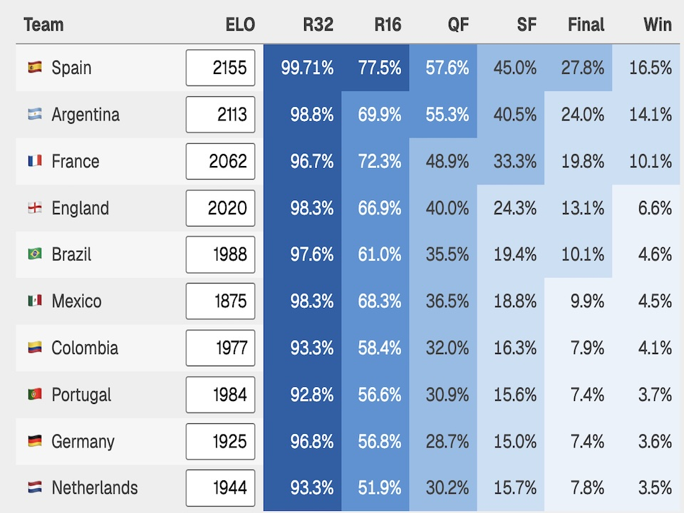

# Football Predictions

[Live demo](https://douwe.com/projects/football_predictions)

Looking for the pre-2026 code? See [`legacy/`](legacy/).



Football Predictions simulates international football tournaments from
pre-tournament ratings and tournament definitions. The current version reads
ratings from
[eloratings.net](https://www.eloratings.net/), runs Monte Carlo simulations of
group stages and knockout brackets, and lets you adjust the model directly in
the browser. Controls include ELO predictive strength, home advantage, recent
form, and late-round effects. The model can also be backtested against completed
World Cups and Euros.

## Run It Yourself

The Python simulator can be run directly against any tournament YAML file:

```bash
python3 simulate.py tournaments/wc_2026.yaml
```

Run more or fewer simulations with `--n`:

```bash
python3 simulate.py tournaments/euro_2024.yaml --n 50000
```

Use `--seed` for reproducible output:

```bash
python3 simulate.py tournaments/wc_2022.yaml --n 10000 --seed 1
```

Example output is a table of each team's probability of reaching later stages
and winning the tournament.

## Layout

- `football_predictions.html` — project metadata, template, and page styles.
- `football_predictions.py` — Django project adapter and lazy backtest endpoint.
- `static/simulate.js` — browser/Node tournament simulator.
- `static/app.js` — frontend controls, rendering, and backtesting.
- `tournaments/` — YAML tournament definitions and historical results.
- `fetch_elo.py` — scraper/updater for ELO ratings and match schedules.
- `simulate.py` — Python simulator used by data tooling.
- `test_*.js` — focused Node tests for simulator/model behavior.

## Data Updates

Tournament YAML files contain:

- `elo` — rating at the tournament cutoff.
- `elo_9m` — rating roughly nine months before the tournament.
- actual group and knockout results, where available.

To refresh one tournament:

```bash
python3 fetch_elo.py tournaments/wc_2026.yaml
```
